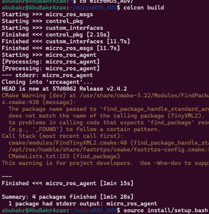

**ROS 2 & micro-ROS Dive In: Low-Cost Underwater Robotics **
ROSCON 2025 Workshop 

_To view the OneDrive version of this document, use https://1drv.ms/w/c/554bc654aaf8931b/EbRougLh_UdBto1Ze_8JsnYBRroAzx8Nokx_JJB3tcR61g?e=L535DV_

**Software pre-requisites:**
1)	A laptop with Ubuntu installed (preferred to be fully installed, not Windows Subsystem for Linux, and version 22.04)
2)	At least ROS2 humble installed (all scripts are tested with ROS2 humble)
3)	At least one working USB-A / USB-C port on your laptop
4)	Docker, while not mandatory, it helps with some additional tutorials
In case some other configurations are used, you can email at abubakr002@e.ntu.edu.sg, so that I can assist as much as possible before the workshop to install the pre-requisites.

**Building from source:**
The following steps, if ran before the workshop can greatly reduce setup time. Assuming that you have ROS 2 installed, please clone the following repository:
1. In your favourite workspace, clone the workshop’s repo: git clone https://github.com/abubakrazam/microROS_AUV.git
2. Navigate inside ("cd microROS_AUV") and clone the required repos for micro-ros:
- git clone -b $ROS_DISTRO https://github.com/micro-ROS/micro-ROS-Agent.git  src/uros/micro-ROS-Agent
- git clone -b $ROS_DISTRO https://github.com/micro-ROS/micro_ros_msgs.git src/uros/micro_ros_msgs
3.	Navigate to the workspace directory and build your workspace using “colcon build”

4.	Once the build is complete, make sure to source the workspace using "source install/setup.bash"
 
**Testing:**
After sourcing (source install/setup.bash), run the following command to verify if micro_ros agent is working:
ros2 run micro_ros_agent micro_ros_agent udp4 --port 8888

 
**Arduino IDE setup**
1. To assist with coding and building firmware, the Arduino IDE will be used. Depending on your operating system (Linux/Windows/Mac), download the app from this platform:
- https://www.arduino.cc/en/software/ (would need Windows Subsystem for Linux)
- https://downloads.arduino.cc/arduino-ide/arduino-ide_2.3.6_Linux_64bit.AppImage
2.	Run the Arduino IDE appimage/exe, then import the “mr_modified_1.zip” as a library in the IDE

 
**Common Issues (will keep adding on)**:
Libpython3.9.so not found …..  You might have multiple versions of python installed (virtual environments, anaconda)

