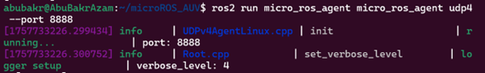
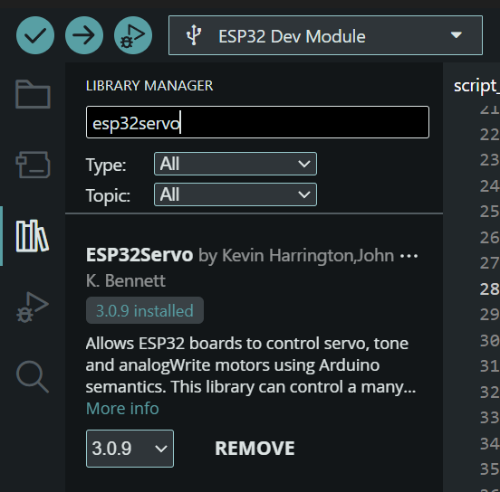

**ROS 2 & micro-ROS Dive In: Low-Cost Underwater Robotics**
ROSCON 2025 Workshop 

_To view the OneDrive version of this document, use https://1drv.ms/w/c/554bc654aaf8931b/EbRougLh_UdBto1Ze_8JsnYBRroAzx8Nokx_JJB3tcR61g?e=L535DV_

**Figures in the last section will be shown during the workshop via PowerPoint since it contains unpublished material**

> **Software pre-requisites:**
1)	A laptop with Ubuntu installed (preferred to be fully installed, not Windows Subsystem for Linux, and version 22.04)
2)	At least ROS2 humble installed (all scripts are tested with ROS2 humble)
3)	At least one working USB-A / USB-C port on your laptop
4)	Docker, while not mandatory, it helps with some additional tutorials

In case some other configurations are used, you can email at abubakr002@e.ntu.edu.sg, so that I can assist as much as possible before the workshop to install the pre-requisites.

> **Building from source:**
The following steps, if ran before the workshop can greatly reduce setup time. Assuming that you have ROS 2 installed, please clone the following repository:
1. In your favourite workspace, clone the workshop’s repo: git clone https://github.com/abubakrazam/microROS_AUV.git
2. Navigate inside ("cd microROS_AUV") and clone the required repos for micro-ros:
- git submodule add -b $ROS_DISTRO https://github.com/micro-ROS/micro-ROS-Agent.git  src/uros/micro-ROS-Agent
- git submodule add -b $ROS_DISTRO https://github.com/micro-ROS/micro_ros_msgs.git src/uros/micro_ros_msgs
3.	Navigate to the workspace directory and build your workspace using “colcon build”

4.	Once the build is complete, make sure to source the workspace using "source install/setup.bash"
 
> **Testing:**
After sourcing (source install/setup.bash), run the following command to verify if micro_ros agent is working:
ros2 run micro_ros_agent micro_ros_agent udp4 --port 8888 
 
> **Arduino IDE setup**
1. To assist with coding and building firmware, the Arduino IDE will be used. Depending on your operating system (Linux/Windows/Mac), download the app from this platform:
- https://www.arduino.cc/en/software/ (would need Windows Subsystem for Linux)
- https://downloads.arduino.cc/arduino-ide/arduino-ide_2.3.6_Linux_64bit.AppImage
2.	Run the Arduino IDE appimage/exe, then import the “mr_modified_1.zip” as a library in the IDE 
3. Select (and install if needed) the ESP32 related files from the board manager (2nd icon on left). Even select “ESP32 Dev module” at the device drop down menu.  

4. 4)	To control the servo motor, install the ESP32servo library in the library manager (3rd icon on the left). 
 
> > **Common Issues (will keep adding on)**:
Libpython3.9.so not found …..  You might have multiple versions of python installed (virtual environments, anaconda)

> **Underwater Robotics – A Brief Introduction**

Autonomy has become a familiar word in our time. Cars navigate highways, drones map forests, and robots assemble products with precision. Each of these systems depends on a shared foundation: perception, decision, and action. Sensors feed data, algorithms interpret it, and actuators carry out commands.

But the ocean resists this neat formula. Beneath the surface, the rules of autonomy are rewritten. GPS signals vanish. Light attenuates within meters. Radio waves, so reliable in air, dissolve almost instantly in water. What remains is a world where communication is fragile, perception is uncertain, and control is always contested by currents and noise.

This is why underwater robotics is not simply a branch of robotics, but a conceptual frontier. It forces us to rethink autonomy under constraint. Where aerial and ground vehicles can rely on abundant, high‑bandwidth sensing, underwater vehicles must make do with sparse, noisy, and often delayed information. SONAR becomes the saviour, but it is costly and imperfect. Inertial systems provide continuity, but they drift. Control surfaces and thrusters respond, but always against the resistance of a dense, dynamic medium.

The challenge, then, is not only technical but philosophical: how do we design systems that are resilient in the face of uncertainty, that can act meaningfully when perception is partial, and that remain affordable enough to democratize exploration?

In this workshop, we approach these questions through analogy and stand‑ins. Ultrasonic sensors will mimic SONAR, servos will stand in for thrusters, and micro‑ROS running on ESP32 boards will serve as the lightweight nervous system of our vehicles. These are not toys; they are abstractions. They allow us to rehearse the logic of autonomy—sensing, deciding, acting—without the prohibitive costs of deep‑sea hardware.

The point is not to simulate the ocean perfectly, but to capture its essence: uncertainty, constraint, and the need for robust design. By the end, you will have touched the same principles that govern real AUVs, and you will see how low‑cost, modular tools can open the door to one of the most challenging domains of robotics.

> **Micro ROS Subscriber: Ultrasonic as SONAR Stand In**

The first step in our journey is to bring sensing into the ROS 2 ecosystem. For this, we deploy a micro ROS subscriber node on the ESP32 that interfaces with the HC SR04 ultrasonic sensor.
The ultrasonic sensor works by sending out a short burst of sound waves and measuring the time it takes for the echo to return. From this, we calculate distance. While this may seem simple, it is conceptually powerful: it is the same principle that underlies acoustic ranging in the ocean. In fact, the HC SR04 is our stand in for a single beam SONAR.

In real AUVs, single beam sonars provide range information that can be fused with inertial data to estimate position. They are noisy, limited in coverage, and often ambiguous — but they are also inexpensive and robust, making them a workhorse in many systems. By using the HC SR04, we give participants a tangible way to experience the same challenges: noisy data, limited field of view, and the need for filtering.

**_To look for script 1_**

Key takeaway: Participants learn how embedded devices can act as ROS native sensors. The ESP32, running micro ROS, doesn’t just collect data — it publishes it into the ROS 2 graph, where it can be logged, visualized, or fused with other streams. This is the first step toward autonomy: perception.

> **Micro ROS Publisher: Servo as Thruster Stand In**

Once we can sense, we need to act. The second exercise introduces a micro ROS publisher node that drives a servo motor.

The servo is our stand in for a thruster channel. In a real AUV, thrusters are commanded by control signals that translate high level navigation goals into physical motion. Here, the servo provides a safe, low cost proxy for propulsion. It allows us to demonstrate how ROS 2 topics can be used to command actuators in real time.

This step is important because it closes the loop between the abstract world of software and the physical world of hardware. Participants will see how a ROS 2 message, published from a laptop or another node, can directly move a piece of hardware.

_**To look for script 2**_

Teaching takeaway: Autonomy is not just about sensing; it is about acting on the world. The servo exercise shows how ROS 2 provides a common language for commanding actuators, whether they are servos in a classroom kit or thrusters in a deep sea vehicle.

> **Combined Deployment: Embedded Autonomy on ESP32**

Now we bring sensing and actuation together into a single script. This is where autonomy begins to emerge.

In this combined deployment, the ESP32 runs a micro ROS script that integrates both the subscriber and publisher logic. The ultrasonic sensor provides distance readings, and the same script evaluates those readings against a threshold. If the distance is safe, the servo continues to run. If the distance falls below the threshold, the script commands the servo to stop.

The key point here is that the decision logic lives inside the micro ROS node itself. This is not just a matter of wiring together a subscriber and a publisher in the ROS 2 graph. Instead, the ESP32 is making decisions locally, at the edge.
This is a critical concept in robotics. In real AUVs, certain safety critical behaviours — such as obstacle avoidance or emergency stop — are often implemented directly on the vehicle’s onboard controller. This ensures that even if the main mission computer fails, the vehicle can still protect itself. By embedding the logic in the micro ROS script, we are demonstrating this principle in a simple, tangible way.

_**To look for script 3**_

Key takeaway: Participants experience a closed loop system where sensing, decision, and actuation are tightly coupled. They see how autonomy can be distributed: some logic runs centrally in ROS 2, while other logic runs locally on embedded devices. This is the essence of resilient design.

> **Best Practices for Robustness**

_**Demos during workshop**_

Finally, we step back and look at how to make these deployments robust and reproducible. Two best practices are highlighted:
1.	Custom ROS Messages in Docker
- In real projects, we often need custom message types to represent specialized data. Building these messages can be tricky, especially across different operating systems and environments.
- By encapsulating the build process in Docker, we ensure that everyone is working in the same environment. This reduces setup friction, avoids “it works on my machine” problems, and makes the workshop reproducible for future learners.
- Conceptually, this is about workflow reproducibility — a principle that scales from classroom exercises to professional research.
2.	Remote Resetting of ESP32 with esptool
-	Embedded devices are notorious for getting stuck, crashing, or misbehaving. In field deployments, you can’t always walk over and press the reset button.
-	Using esptool to remotely reset the ESP32 demonstrates how we can maintain control over embedded devices even when they are misbehaving.
-	Conceptually, this is about resilience — designing systems that can recover gracefully from failure.
  
Key takeaway: These best practices show participants that robotics is not just about making things work once; it is about making them work reliably, reproducibly, and recoverably.

> **ROS2, Micro-ROS + AUVs**

Now that you’ve seen how we can use low cost stand ins to explore the principles of underwater autonomy, let me share a glimpse of what we work on in practice.
In our research, we move from ultrasonic sensors and servos to the real building blocks of autonomous underwater vehicles. For localization, we fuse data from inertial measurement units (IMUs) with single beam sonars, using Kalman filters to smooth out the noise and drift that each sensor carries on its own.

(KF figure here)

When we step up to forward looking sonars (FLS), we often use a parent–child architecture: the single beam sonar provides a baseline for position, while the FLS adds richer spatial context. This layered approach lets us balance cost, accuracy, and robustness. We have also developed faster versions of the denoising algorithms, AUV tracking and conversion to transform trees, and many other algorithms to support multiple AUVs.
(parent-child, cfar figure here)

We also work on position based mosaicking of optical images. Since visibility underwater is limited, a single image rarely tells the whole story. By stitching images together based on vehicle position, we can reconstruct larger scenes — a kind of underwater map built from fragments.

(optical image mosaicking figure here)

And with FLS, we go further: by combining trigonometry with vehicle motion and single beam localization, we can generate point clouds that reveal the structure of the environment. It’s a way of turning noisy acoustic echoes into usable 3D information.

(PCD figure here)

These are the same principles you’ll be touching today in simplified form. The difference is scale and fidelity — but the logic of sensing, fusing, and acting is the same. What you build with an ultrasonic sensor and a servo is the seed of what we deploy with SONARs, IMUs, and thrusters in the ocean.

